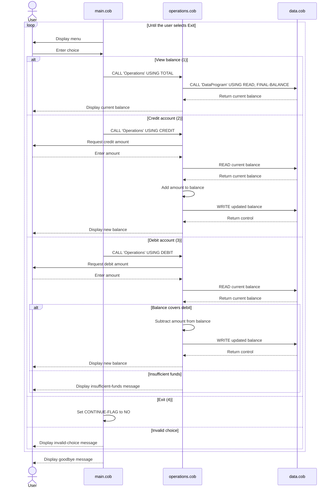

# COBOL Account Management

This directory documents the COBOL account-management example in `src/cobol`. The program provides a console menu for viewing a student account balance and applying credits or debits.

## Program flow

`main.cob` displays the menu and dispatches the selected action to `Operations`. `Operations` reads the current balance from `DataProgram`, performs the requested calculation, and writes successful changes back. `DataProgram` owns the balance value for the life of the program.

## COBOL files

### `main.cob`

**Purpose:** Entry point and user interface.

**Key responsibilities:**

- Displays the Account Management System menu.
- Accepts a numeric choice from 1 through 4.
- Calls `Operations` with the six-character operation code:
  - `TOTAL ` for viewing the balance.
  - `CREDIT` for adding funds.
  - `DEBIT ` for withdrawing funds.
- Repeats until the user selects Exit.
- Displays an error for any other menu choice.

### `operations.cob`

**Purpose:** Implements account transactions and balance queries.

**Key responsibilities:**

- Handles `TOTAL ` by reading and displaying the current balance.
- Handles `CREDIT` by accepting an amount, adding it to the current balance, and saving the result.
- Handles `DEBIT ` by accepting an amount, checking available funds, and saving the reduced balance when allowed.
- Displays a success message after a credit or debit is saved.
- Rejects a debit when the requested amount is greater than the current balance.

`Operations` receives its requested action through the `PASSED-OPERATION` linkage item and calls `DataProgram` with `READ` or `WRITE` to access the balance.

### `data.cob`

**Purpose:** Stores and retrieves the account balance.

**Key responsibilities:**

- Initializes `STORAGE-BALANCE` to `1000.00`.
- Supports `READ`, copying the stored balance into the caller's `BALANCE` parameter.
- Supports `WRITE`, copying the caller's `BALANCE` parameter into storage.
- Returns control to the caller with `GOBACK`.

The balance is held in working storage, so it is in-memory state and is not written to a file or database.

## Student-account business rules

- A new program run starts with a balance of `1000.00`.
- Viewing the balance does not change the account.
- Credits increase the balance by the amount entered.
- Debits decrease the balance only when `current balance >= debit amount`.
- An insufficient-funds debit is rejected, displays `Insufficient funds for this debit.`, and leaves the stored balance unchanged.
- Successful credits and debits persist only for the current program run through `DataProgram` working storage.
- The menu accepts only choices 1 through 4; other choices do not perform an account operation.
- The source does not define validation for negative, zero, or malformed transaction amounts. Input is accepted using the COBOL numeric field defined in `operations.cob`.

## Operation codes

| Caller action | Code sent to `Operations` | Data action |
| --- | --- | --- |
| View balance | `TOTAL ` | `READ` |
| Credit account | `CREDIT` | `READ`, add, `WRITE` |
| Debit account | `DEBIT ` | `READ`, compare, optional subtract and `WRITE` |

## Application data flow

